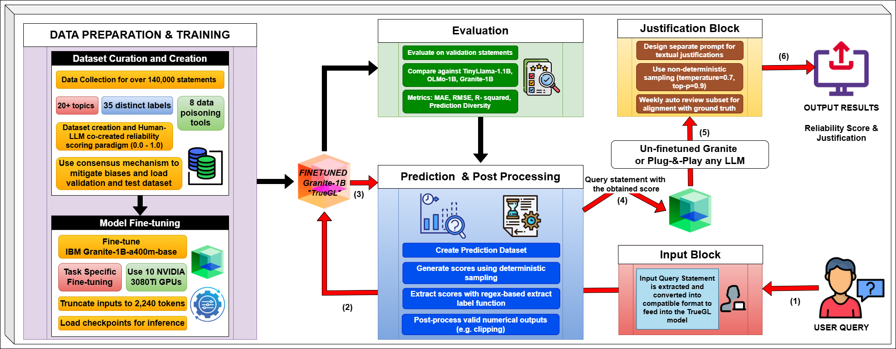
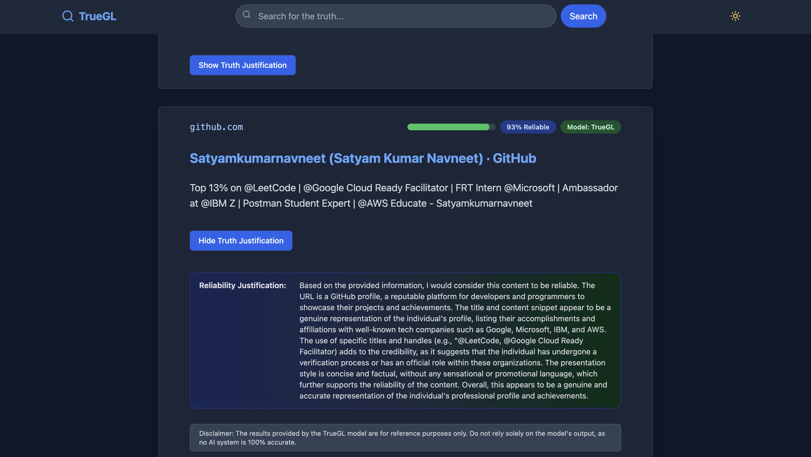

<div align="center">

# 🔍 TrueGL: A Truthful, Reliable, and Unified Engine for Grounded Learning in Full-Stack Search


</div>


<div align="center">
  
  <p><em>TrueGL's intuitive search interface with integrated truth scoring</em></p>
</div>

<div align="center">

[](https://arxiv.org/abs/2506.12072v2)
[](https://github.com/Satyamkumarnavneet/TrueGL)
[](https://huggingface.co/JoydeepC/trueGL)
[](LICENSE)

</div>

## 💡 Overview

<div align="center">

**TrueGL** is a comprehensive full-stack search engine designed to assess the truthfulness and reliability of textual information. Built on fine-tuned large language models (LLMs), TrueGL provides users with reliable truth scores for search results, helping combat misinformation and promote information literacy.

<br/>


</div>

<div align="center">
  
  <p><em>TrueGL's comprehensive workflow from data ingestion to truth assessment</em></p>
</div>

---

### 🎯 **What's Included**

This repository contains the complete implementation of TrueGL, including:
- **Fine-tuned Granite-3.1-1B model** for truth assessment
- **Full-stack web application** with React frontend and Python backend
- **Comprehensive evaluation frameworks** (LLM-based and rule-based)
- **Data generation and processing pipelines**
- **Training and inference infrastructure**

## 📋 Table of Contents

- [Features](#features)
- [Architecture](#architecture)
- [Installation](#installation)
- [Quick Start](#quick-start)
- [Project Structure](#project-structure)
- [Usage](#usage)
- [Model Training](#model-training)
- [Evaluation](#evaluation)
- [Data Generation](#data-generation)
- [API Documentation](#api-documentation)
- [Contributing](#contributing)
- [Citation](#citation)
- [License](#license)

## 🚀 Features

<div align="center">

<table>
<tr>
<td align="center" width="33%">

<br/>
<strong>Advanced LLM-based scoring</strong><br/>
<em>Scale: 0.0-1.0 reliability</em>
</td>
<td align="center" width="33%">

<br/>
<strong>Fast, accurate search with</strong><br/>
<em>integrated truth scoring</em>
</td>
<td align="center" width="33%">

<br/>
<strong>Neural & rule-based</strong><br/>
<em>assessment methods</em>
</td>
</tr>
<tr>
<td align="center" width="33%">

<br/>
<strong>Transparent source tracking</strong><br/>
<em>& reliability metrics</em>
</td>
<td align="center" width="33%">

<br/>
<strong>Modern React-based</strong><br/>
<em>web application</em>
</td>
<td align="center" width="33%">

<br/>
<strong>Efficient inference &</strong><br/>
<em>caching mechanisms</em>
</td>
</tr>
</table>

</div>

### Core Capabilities

- **Truth Assessment**: Advanced LLM-based scoring of statement reliability (0.0-1.0 scale)
- **Real-time Search**: Fast, accurate search with integrated truth scoring
- **Multi-modal Evaluation**: Both neural and rule-based assessment methods
- **Source Verification**: Transparent source tracking and reliability metrics
- **User-friendly Interface**: Modern React-based web application

### Technical Highlights

- **Fine-tuned Model**: Granite-3.1-1B optimized for truth assessment
- **Scalable Architecture**: Modular design supporting multiple evaluation backends
- **Comprehensive Datasets**: Combines FEVER, SciFact, and custom fake news datasets
- **Advanced Filtering**: Multi-dimensional search with truth score filtering
- **Performance Optimized**: Efficient inference and caching mechanisms

## 🏗️ Architecture

```
TrueGL Architecture
├── Frontend (React + TypeScript)
│   ├── Search Interface
│   ├── Results Display
│   └── Truth Score Visualization
├── Backend (Python Flask/FastAPI)
│   ├── Search API
│   ├── Truth Assessment Service
│   └── Database Management
├── ML Pipeline
│   ├── Fine-tuned Granite Model
│   ├── Rule-based Scorer
│   └── Ensemble Methods
└── Data Processing
    ├── Web Crawling
    ├── Data Cleaning
    └── Truth Labeling
```

## 🛠️ Installation

### Prerequisites
- Python 3.8+
- Node.js 16+
- CUDA-compatible GPU (recommended for training)
- 16GB+ RAM

### Environment Setup

1. **Clone the repository**
```bash
git clone https://github.com/AlgazinovAleksandr/TrueGL.git
cd TrueGL
```

2. **Set up Python environment**
```bash
# Create virtual environment
python -m venv truegl_env
source truegl_env/bin/activate  # On Windows: truegl_env\Scripts\activate

# Install Python dependencies
pip install -r requirements.txt
```

3. **Set up Node.js environment**
```bash
cd application
npm install
```

4. **Download pre-trained models**
```bash
# Download fine-tuned Granite model
python scripts/download_models.py
```

## ⚡ Quick Start

### Running the Application

1. **Start the Backend**
```bash
cd application/search_api
python main.py
```

2. **Start the Frontend**
```bash
cd application
npm run dev
```

3. **Access the Application**
Open your browser and navigate to `http://localhost:5173`

### Basic Usage Example

```python
from truegl import TruthAssessor

# Initialize the truth assessor
assessor = TruthAssessor(model_path="path/to/granite-model")

# Assess a statement
statement = "The Earth is approximately 4.5 billion years old."
score = assessor.assess(statement)
print(f"Truth Score: {score:.3f}")  # Output: Truth Score: 0.892
```

## 📁 Project Structure

```
TrueGL/
├── application/                     # Web application
│   ├── src/                        # React frontend source
│   │   ├── components/             # UI components
│   │   ├── pages/                  # Page components
│   │   ├── services/               # API services
│   │   └── types/                  # TypeScript definitions
│   ├── search_api/                 # Python backend
│   │   ├── main.py                # Main API server
│   │   ├── search_service.py      # Search functionality
│   │   └── functions/             # Additional API functions
│   └── public/                     # Static assets
├── Data-Generation/                 # Data processing scripts
│   ├── Existing_Articles_Modification.py
│   └── New_Articles_Generation.py
├── evaluation/                      # Evaluation frameworks
│   ├── LLM_evaluation/             # LLM-based evaluation
│   │   ├── EVALUATION_Prompt_1.ipynb
│   │   ├── EVALUATION_Prompt_2.ipynb
│   │   └── EVALUATION_Prompt_3.ipynb
│   └── rule-based/                 # Rule-based evaluation
│       └── rule-based.py
├── Fine-Tuning Data/               # Training datasets
│   ├── fake_news_data/            # Fake news datasets
│   └── scientific_facts_data/     # Scientific fact datasets
├── TrueGL_training_and_inference/  # Model training
│   ├── finetune_granite_V2.py     # Training script
│   └── TrueGL_Granite_model_inference.ipynb
├── 2506.12072v2.pdf               # Research paper
└── README.md                       # This file
```

## 💻 Usage

### Web Interface

1. **Search for Information**: Enter your query in the search box
2. **Review Results**: Browse search results with integrated truth scores
3. **Filter by Reliability**: Use truth score filters to find reliable sources
4. **Analyze Sources**: View detailed source analysis and reliability metrics

### Python API

```python
# Basic truth assessment
from truegl import TruthAssessor

assessor = TruthAssessor()
score = assessor.assess("Climate change is caused by human activities.")
print(f"Truth Score: {score}")

# Batch processing
statements = [
    "Water boils at 100°C at sea level.",
    "The moon is made of green cheese.",
    "Python is a programming language."
]

scores = assessor.assess_batch(statements)
for stmt, score in zip(statements, scores):
    print(f"{stmt}: {score:.3f}")
```

### Command Line Interface

```bash
# Assess a single statement
python -m truegl.cli assess "The sun is a star."

# Process a file of statements
python -m truegl.cli batch_assess statements.txt --output results.csv

# Start the web server
python -m truegl.cli serve --port 8000
```

## 🎯 Model Training

### Fine-tuning the Granite Model

```bash
cd TrueGL_training_and_inference

# Prepare training data
python prepare_data.py --input_dir "../Fine-Tuning Data" --output_file "training_data.csv"

# Start fine-tuning
python finetune_granite_V2.py \
    --model_path "granite-3.1-1b-base" \
    --data_path "training_data.csv" \
    --output_dir "granite-truegl" \
    --epochs 5 \
    --batch_size 8
```

### Training Configuration

Key parameters for model training:
- **Model**: Granite-3.1-1B base model
- **Learning Rate**: 3e-5
- **Batch Size**: 6-8 (depending on GPU memory)
- **Max Length**: 2240 tokens
- **Epochs**: 5
- **Validation Split**: 2%

## 📊 Evaluation

### Running Evaluations

1. **LLM-based Evaluation**
```bash
cd evaluation/LLM_evaluation
jupyter notebook EVALUATION_Prompt_1.ipynb
```

2. **Rule-based Evaluation**
```bash
cd evaluation/rule-based
python rule-based.py --input_file "test_data.csv" --output_dir "results/"
```

### Evaluation Metrics

- **Mean Absolute Error (MAE)**
- **Root Mean Square Error (RMSE)**
- **R² Score**
- **Pearson Correlation**
- **Precision/Recall for binary classification**

## 🗃️ Data Generation

### Creating Training Data

```bash
cd Data-Generation

# Modify existing articles
python Existing_Articles_Modification.py \
    --input_file "articles.csv" \
    --output_file "modified_articles.csv" \
    --modification_rate 0.3

# Generate new articles
python New_Articles_Generation.py \
    --num_articles 1000 \
    --output_file "generated_articles.csv"
```

### Data Sources

- **FEVER Dataset**: Fact verification dataset
- **SciFact**: Scientific claim verification
- **Custom Fake News**: Curated misinformation examples
- **News Articles**: Real news with reliability annotations

## 📖 API Documentation

### REST API Endpoints

#### Search Endpoint
```
POST /api/search
{
    "query": "climate change effects",
    "filters": {
        "min_truth_score": 0.7,
        "max_results": 20
    }
}
```

#### Truth Assessment Endpoint
```
POST /api/assess
{
    "statement": "The Earth is flat.",
    "include_explanation": true
}
```

#### Batch Assessment Endpoint
```
POST /api/assess/batch
{
    "statements": ["Statement 1", "Statement 2"],
    "return_details": false
}
```

### Response Format

```json
{
    "truth_score": 0.123,
    "confidence": 0.89,
    "explanation": "Low reliability due to contradicting scientific evidence...",
    "sources": [
        {
            "url": "https://example.com",
            "title": "Source Title",
            "reliability_score": 0.85
        }
    ]
}
```

## 🤝 Contributing

We welcome contributions! Please see our [Contributing Guidelines](CONTRIBUTING.md) for details.

### Development Setup

1. Fork the repository
2. Create a feature branch
3. Make your changes
4. Add tests
5. Submit a pull request

### Code Style

- **Python**: Follow PEP 8, use `black` for formatting
- **TypeScript/React**: Follow Airbnb style guide, use `prettier`
- **Documentation**: Use clear docstrings and comments

## 🎯 Demo & Screenshots

### Search Interface
<div align="center">
  
  <p><em>Clean, intuitive search interface with truth score integration</em></p>
</div>

### Search Results with Truth Scores
<div align="center">
  
  <p><em>Search results displaying reliability scores and source verification</em></p>
</div>

### Detailed Analysis View
<div align="center">
  
  <p><em>Comprehensive analysis with detailed truth assessment metrics</em></p>
</div>

### Key Features in Action

- **📊 Real-time Truth Scoring**: See reliability scores instantly with your search results
- **🔍 Advanced Filtering**: Filter content by truth score, source reliability, and topic
- **📈 Detailed Analytics**: Get comprehensive breakdowns of assessment reasoning
- **🌐 Multi-source Verification**: Cross-reference information across multiple reliable sources

## 📄 Citation

If you use TrueGL in your research, please cite our paper:

```bibtex
@misc{chandra2025truegltruthfulreliableunified,
      title={TrueGL: A Truthful, Reliable, and Unified Engine for Grounded Learning in Full-Stack Search}, 
      author={Joydeep Chandra and Aleksandr Algazinov and Satyam Kumar Navneet and Rim El Filali and Matt Laing and Andrew Hanna},
      year={2025},
      eprint={2506.12072},
      archivePrefix={arXiv},
      primaryClass={cs.IR},
      url={https://arxiv.org/abs/2506.12072}, 
}
```

## 📄 License

This project is licensed under the MIT License - see the [LICENSE](LICENSE) file for details.
---